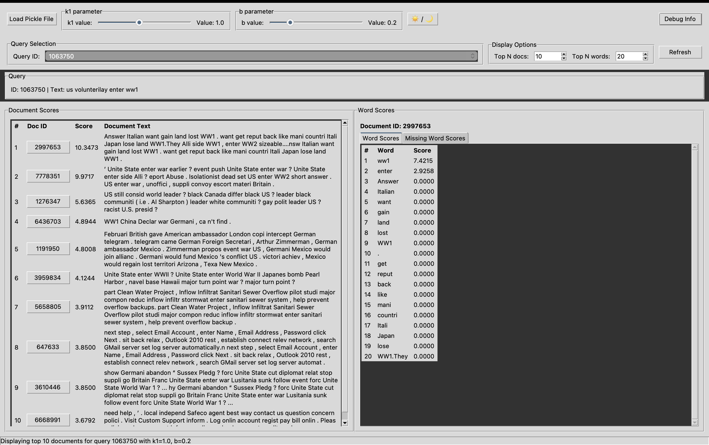
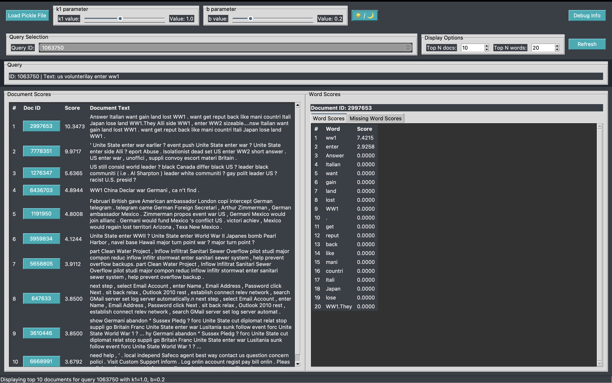
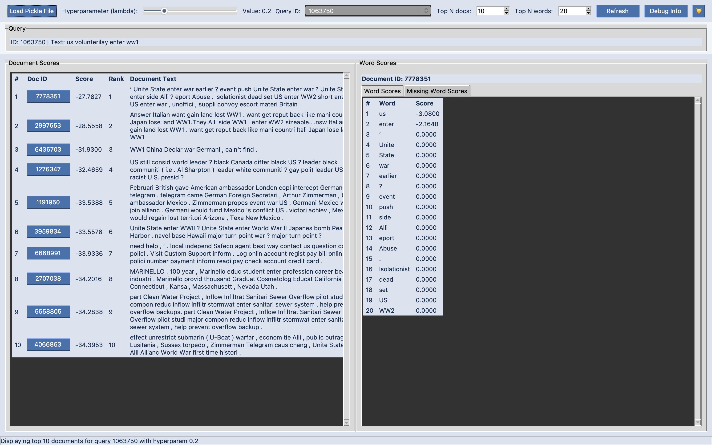
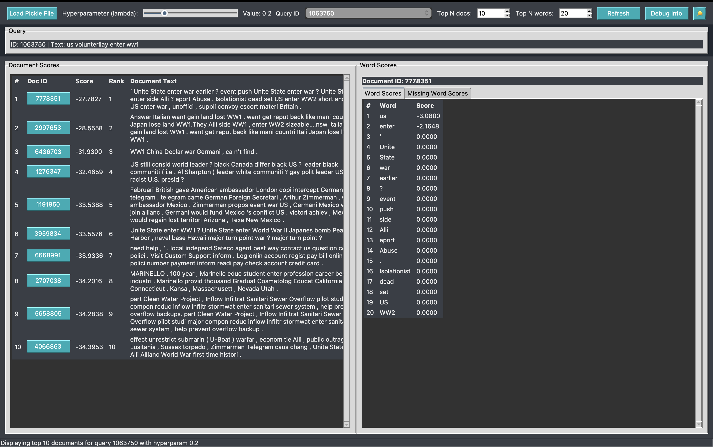

# CS879Project
CS879 Reusable Learning Objective


## Context
**COMPSCI 446 (Search Engines):** is an undergraduate level course on information retrieval at UMass, where students get to learn about different retrieval models and how the design decisions made in constructing those retrieval models affect ranking.

**Our Project:** We plan to create a interactive Jupyter notebook that allows students to visualize key topics from the course.

## Goals
WHAT skills will our RLO promote?
- Visual learning.
- Interactive learning.
- Immersive experience.
HOW will it promote it?
- Offer to students to prime for assignments and exams.
- Demonstration in class.
- It may be part of the third major programming assignment


## Accessibility
In consideration of accessiblity, we are considering color blindness in our models. 

- Colorblind-friendly palettes: Use high-contrast, colorblind-friendly color schemes (e.g., Viridis, Color Universal Design).
- Alternative visual encodings: Use patterns, shapes, or text labels in addition to color to convey information.

## Usage

### Setup

We recommend creating a fresh `miniconda` environment for this project.  To do this, install miniconda3 following [these instructions](https://www.anaconda.com/docs/getting-started/miniconda/install#linux-terminal-installer).  Then, create & activate a fresh conda environment using:
```bash
conda create -n CS879 python=3.12
conda activate CS879
```

Next, install the requirements for the project with:

```bash
pip install -r requirements.txt
```

### Creating Data

To download and process the required data please run `python msmarco.py`, which will create `data/data.json`, which contains all of the necessary data.  The data will then be stored in `data/data.json`, a JSON file containing the following keys:
- `queries: dict[str, list[str]]`  
  Mapping each query ID to its raw tokenized text (list of words)

- `queries_stopped: dict[str, list[str]]`  
  Mapping each query ID to its tokenized text after stopword removal

- `queries_stemmed: dict[str, list[str]]`  
  Mapping each query ID to its tokenized text after stemming

- `queries_stopped_stemmed: dict[str, list[str]]`  
  Mapping each query ID to its tokenized text after stopword removal and stemming

- `documents: dict[str, list[str]]`  
  Mapping each document ID to its raw tokenized text (list of words)

- `documents_stopped: dict[str, list[str]]`  
  Mapping each document ID to its tokenized text after stopword removal

- `documents_stemmed: dict[str, list[str]]`  
  Mapping each document ID to its tokenized text after stemming

- `documents_stopped_stemmed: dict[str, list[str]]`  
  Mapping each document ID to its tokenized text after stopword removal and stemming

- `qrels: dict[str, dict[str, int]]`  
  Mapping each query ID to a dictonary mapping document IDs to their revelance scores.  Not complete (assume missing values are 0)

### Retrieval Models

`retrieval_models.py` contains specialized implementations of the TF, QL and BM25 retrieval models that return document
 scores on a per-word level, for each word in the document.  This allows the visualizer (TODO) to visualize what parts 
 of each document contribute the most to the score.  

In this project, we represent a scored document with the `ScoredDocument` class, which has the attributes:
- `d_id: str` the document id
- `score: float` the score of the document
- `word_scores: dict[str, float]` a dictionary mapping each word in the document to the score in contributes to `score`
- `missing_word_scores: dict[str, float]` a dictionary mapping any words that are not present in the document to their
 impact on the score.  This is only currently used in the QL model.

To get `ScoredDocument`s, you can call one of the retrieval functions, `compute_tf`, `compute_bm25`, `compute_ql`, which
 each take in a list of queries, a list of documents, and potentially some parameters for the retrieval model as well, 
 and return a `RetrievalModelScores` object.  Each `RetrievalModelScores` object has a single attribute, `doc_scores`, 
 which is a dictionary mapping query IDs to dictionaries mapping document IDs to `ScoredDocument` objects.

#### Computing metrics

Retrieval metrics can be computed using `RetrievalModelScores.compute_metrics`, which uses `pytrec_eval` to compute 
 retrieval metrics.


## Project Hierarchy

- `data/` is where processed data is stored
- `indexes/` is a cache directory for storing built bm25s indexes
- `notebooks/` contains miscellaneous `.ipynb` notebooks to test and develop this project
- `msmarco.py` contains the code to download, process and save the necessary data for this project.
- `retrieval_models.py` contains implementations of retrieval models

## Requirements
- Python 3.8
- `ir_datasets`
- `numpy`
- `PyStemmer`
- `bm25s`
- `nltk`
- `Pytrec_eval`

## Run Instructions
To run, run the desired visualization from the options in the table.

| File Name            | Associated Pickle        |
|----------------------|---------------------------|
| /visualizations/visualize_bm25.py      | /notebooks/bm25_range.pkl            |
| /visualizations/visualize_ql.py     | /notebooks/ql_dict_wqueryinfo.pkl           |

For example to run bm25
```
cd visualizations
python3 visualize_bm25.py
```

In the top right, there will be a button reading `Load Pickle File` to chose the desired pickle file that contains the data based on the above table.

## Sample Screens
Below are sample screenshots of the light and dark mode versions of each query type visualization.
### BM25 Images
<div style="display: flex; justify-content: space-between;">


</div>


### QL Images
<div style="display: flex; justify-content: space-between;">


</div>